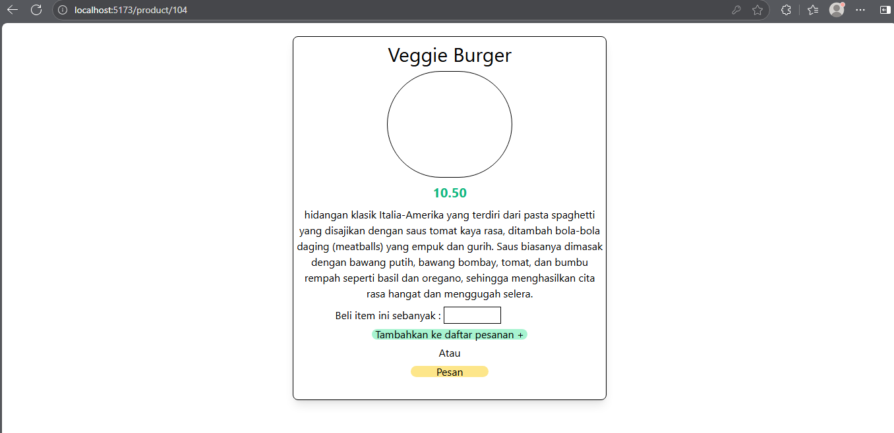

# Membuat WebApp + sistem database OLTP
sumber dataset : Maven Analytics : https://app.mavenanalytics.io/datasets

# frontend
- windiCSS
- useQuery -> fetching data + cache agar tidak fetch data setiap saat
- react router dom
- redux jstoolkit (menghandle state global untuk cart dalam webapp)
- pagination

# Backend
- Disimpan dalam cookies
- login menggunakan jwt token
- menggunakan framework express
- nanoid buat id unik
- bcrypt buat hash password
- driver pg dari postgresql buat menulis sql di express

# Database
- PostgreSql

# Contoh Tampilan

1. Login Page

2. Tampilan awal 

3. Detailed item page

4. Cart Page

5. Pagination bekerja

6. kerja modal
